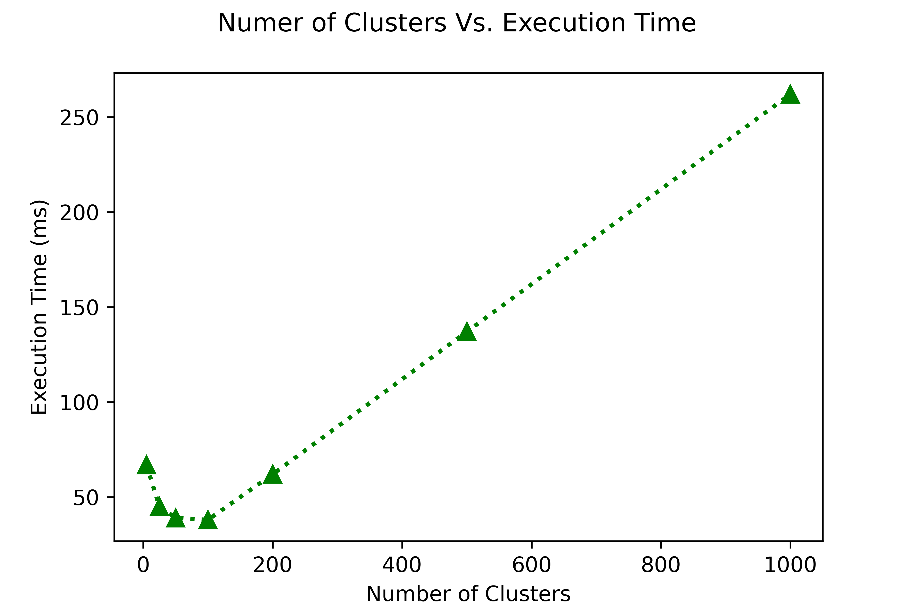
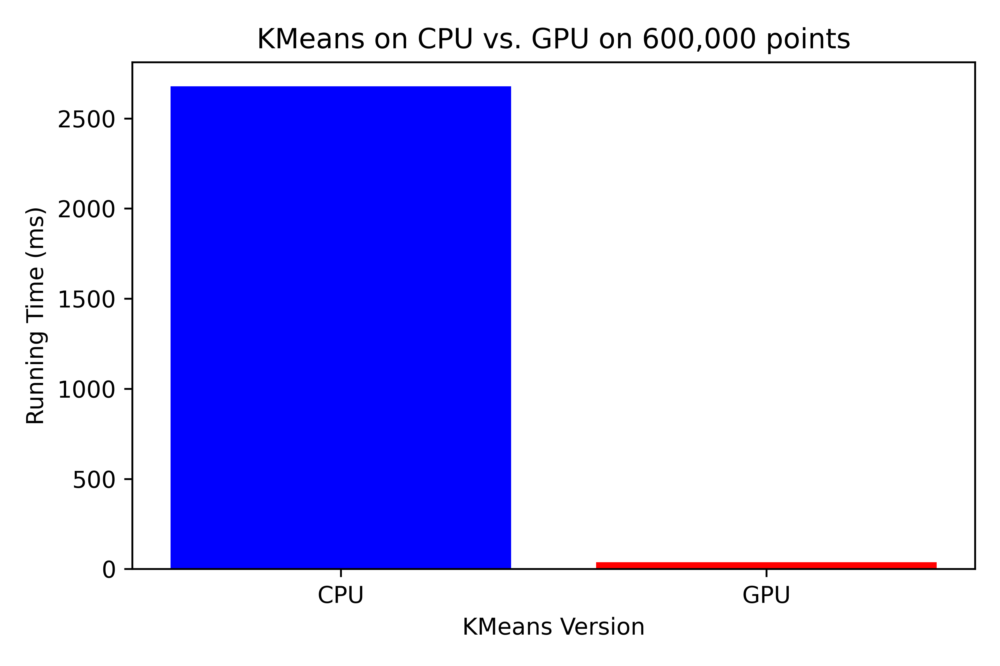
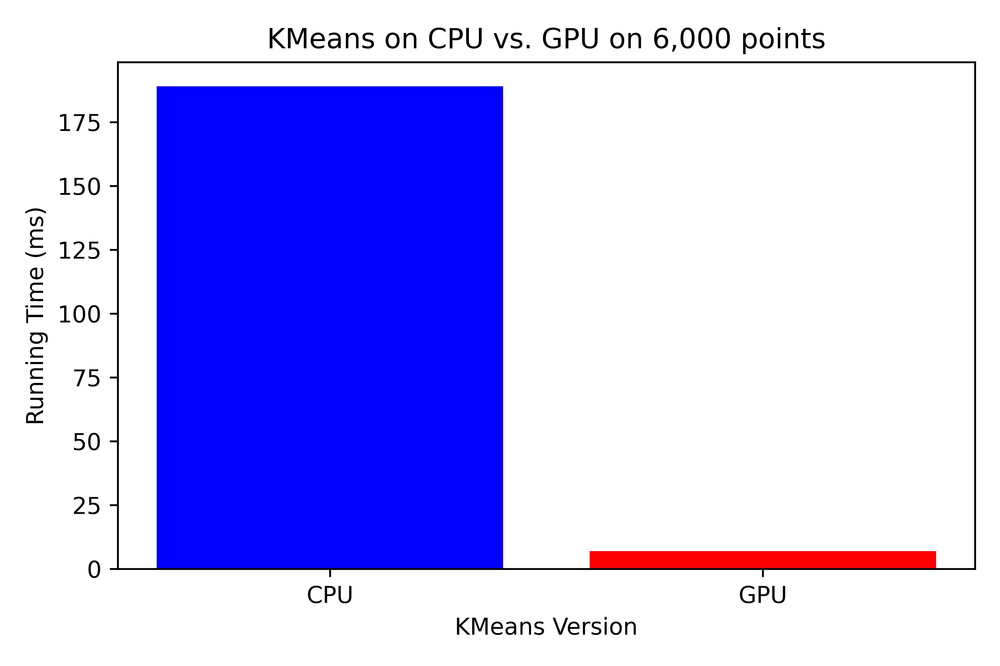
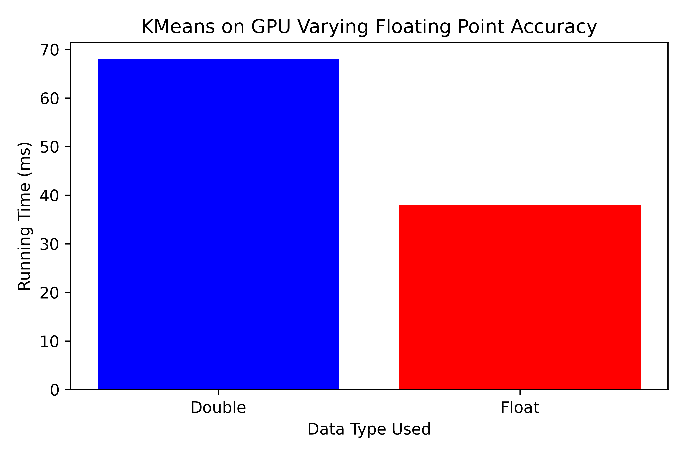

## GPUkMeans

**GPU-accelerated K-Means Clustering**

This repository implements the K-Means clustering algorithm using CUDA for efficient GPU acceleration. It's inspired by the work at [https://github.com/marcoscastro/kmeans](https://github.com/marcoscastro/kmeans).

**Key Features:**

* Leverages CUDA for significant performance gains on compatible GPUs compared to CPU-based implementations.
* Provides clear separation of CPU and GPU code for better maintainability.
* Offers flexibility to run the algorithm on both CPU and GPU for comparison or resource-constrained scenarios.

**Getting Started:**

**Prerequisites:**

* A CUDA-enabled NVIDIA GPU
* CUDA Toolkit installed ([https://developer.nvidia.com/cuda-downloads](https://developer.nvidia.com/cuda-downloads))

**Running the Code:**

**CPU:**

```bash
./runCPU.sh
```

**GPU:**

```bash
./runGPU.sh
```

**Configuration:**

The scripts `runCPU.sh` and `runGPU.sh` accept command-line options for fine-tuning various aspects of the K-Means algorithm. Here's a breakdown of the available options:

| Option | Description | Default Value |
|---|---|---|
| `-k` | Number of clusters (K) | 100 |
| `-s` | Random seed for initialization | 0 |
| `-h` | help |  |

**Explanation:**

- `-k`: This option allows you to specify the desired number of clusters (K) for the K-Means algorithm. The default value is typically defined within the script itself.
- `-s`: This option sets the random seed used for initializing the K-means algorithm. This helps control the initial placement of centroids and can influence the final clustering results.

**Modifying Configuration:**

To utilize these options, execute the scripts with the desired flags and arguments, cating the dataset you want to use. For example, to run wine dataset on the CPU version with 10 clusters, a random seed of 123:

```bash
cat datasets/wine.txt |  ./obj32/runCPU.sh -k 10 -s 123
```

## Benchmarking

This section showcases the performance improvements achieved by our GPU-accelerated K-Means implementation compared to the original CPU-based version. The graphs are generated by the `graphing/graphs.py` file.

**Number of Clusters vs. Execution Time:**



This graph depicts the impact of varying cluster count (K) on execution time. As expected, the execution time generally increases with a larger number of clusters. However, at low cluster counts preformance suffers from high contention on the cluster sum values.

**CPU vs. GPU Performance:**

We evaluated the performance difference between CPU and GPU execution on datasets of varying sizes:

* **600,000 Data Points:**



As shown, the GPU execution offers a substantial performance advantage compared to the CPU for a large dataset of 600,000 data points.

* **6,000 Data Points (Wine Dataset):**



Even for a smaller dataset like the Wine dataset (around 6,000 points), the GPU execution exhibits faster performance.

**Double vs. Float Precision on GPU:**



This graph explores the trade-off between data type and execution time on the GPU. Using single-precision floating-point numbers (float) leads to a slight performance gain compared to double-precision (double) while maintaining acceptable accuracy for many K-Means applications.

**Note:**

* The actual performance gains may vary depending on your hardware configuration, dataset size, and cluster count.
* It's recommended to experiment with both CPU and GPU versions and choose the option that best suits your resource constraints and performance requirements.

**Additional Considerations:**

* While this example focuses on execution time, other factors like memory usage and power consumption might also be relevant in certain scenarios.

## TO DO

* Parallel reduction in shared memory
* Multi GPU version